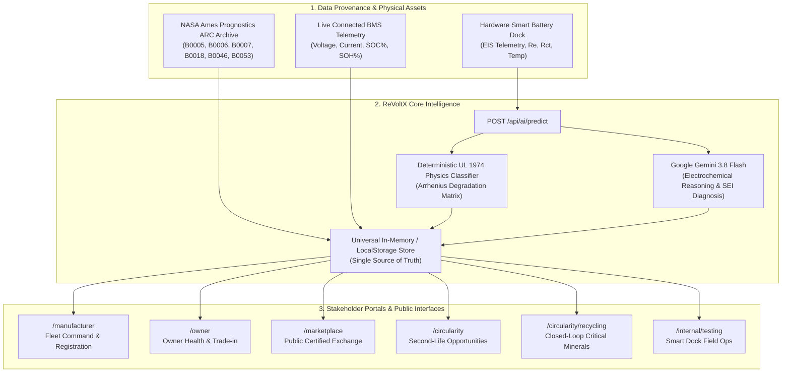

<div align="center">

# ⚡ ReVoltX

### **Every Battery Has a Second Life.**
**The Industrial-Grade Continuous Battery Lifecycle & Digital Passport Platform**

[](https://nextjs.org/)
[](https://react.dev/)
[](https://www.typescriptlang.org/)
[](https://ai.google.dev/)
[](https://eur-lex.europa.eu/eli/reg/2023/1542/oj)
[](https://www.ul.com/)
[](https://www.nasa.gov/)

<br />

[Explore Platform](#-key-capabilities) •
[System Architecture](#-system-architecture) •
[NASA Dataset Integration](#-grounded-in-nasa-arc-prognostics) •
[AI RX Engine (Gemini 3.8)](#-revoltx-ai-rx-engine) •
[Getting Started](#-getting-started)

</div>

---

## 📌 Executive Summary

Over **70% of retired Electric Vehicle (EV) batteries** are prematurely shredded or landfilled despite retaining **70%–80% usable electrochemical retention**. This represents **$120B in trapped economic value** and immense supply-chain strain for virgin battery minerals.

**ReVoltX** bridges the critical data divide between physical battery assets and circular economy stakeholders. By unifying **Electrochemical Impedance Spectroscopy (EIS)**, real-time BMS telemetry, **NASA Ames Prognostics Aging Datasets**, and a **Google Gemini 3.8 Flash Predictive Engine**, ReVoltX creates an unbroken digital passport verifying safety, residual life, and secondary commercial value from manufacturing to closed-loop hydrometallurgical recycling.

---

## 🌟 Key Capabilities

### 1. 🌐 Immutable Digital Battery Passport (EU 2023/1542 Compliant)
- **Cradle-to-Cradle Cryptographic Provenance**: Dynamic digital twins tracking cell assembly, OEM batch certification, carbon footprint, warranty, and chain-of-custody handovers.
- **Physical QR Serialization**: Accessible instantly via QR scan or global asset IDs (`RX-YYYY-XXXXXX`).

### 2. 🧠 ReVoltX AI "RX Engine" (Gemini 3.8 + Electrochemical Physics)
- **Hybrid Decision Engine**: Evaluates capacity retention (SOH), cycle life velocity (RUL), and internal resistance ($R_e, R_{ct}$) against **UL 1974** standard thresholds.
- **3-Way Autonomous Classification**:
  - **Primary Mobility (`CONTINUE_USE`)**: $\text{SOH} \ge 80\%$, $R_e < 0.045\,\Omega$. Cleared for high-stress EV courier duty.
  - **Secondary Storage (`SECOND_LIFE`)**: $65\% \le \text{SOH} < 80\%$. Ranked for stationary solar microgrid BESS, telecom tower UPS standby, or warehouse AGVs.
  - **Closed-Loop Recycling (`RECYCLE`)**: $\text{SOH} < 65\%$ or critical impedance spikes. Dispatched for critical mineral recovery.
- **Deep LLM Diagnosis**: Integrated with **Gemini 3.8 Flash** (`gemini-3.8-flash`) to generate human-readable electrochemical failure mechanisms (SEI growth, lithium plating risk, active material loss).

### 3. 🔬 Smart Battery Dock Diagnostic Hardware
- **Technician Field Assessment Flow**: Simulated 7-step hardware dock testing capturing cell voltage balance, thermal dissipation deltas, and multi-frequency Nyquist impedance waveforms.
- **Direct Cloud Sync**: On-site validation pushes single-source-of-truth updates to all stakeholders instantly.

### 4. 🏢 Multi-Stakeholder Unified Operating Portals
| Portal | Primary Audience | Core Workflow |
| :--- | :--- | :--- |
| **Manufacturer & Fleet** | Battery OEMs, Fleet Managers | Production asset registration, real-time fleet health bento, EIS alert tracking, issue reporting. |
| **Customer / Owner** | EV Drivers, Commercial Operators | SOH monitoring, degradation prediction curves, certified pack trade-in valuation, mobile service booking. |
| **Public Marketplace** | Energy Installers, Secondary Buyers | Frictionless public catalog of certified second-life packs with transparent SOH, prices, and doorstep delivery. |
| **Circularity Partner** | BESS Integrators, Solar Installers | Sourcing qualified second-life stationary battery cohorts with verified remaining cycle capacity. |
| **Recycler Hub** | Hydrometallurgical Refineries | Inbound decommissioned pack logs, critical mineral yield tracking (Lithium, Nickel, Cobalt, Manganese). |
| **Internal Operations** | ReVoltX Field Technicians | Smart Dock testing station, dispatch fleet routing, service request management. |

---

## 🏛 System Architecture



---

## 🛰 Grounded in NASA ARC Prognostics

ReVoltX is not built on placeholder mocks. All baseline battery degradation profiles, electrochemical impedances, and cycling wear curves are extracted from the **NASA Ames Prognostics Center of Excellence (PCoE) Battery Aging ARC Datasets** located in `5. Battery Data Set/`:

- **NASA ARC B0005** (`RX-2026-892738`):
  - Baseline $1.8565\,\text{Ah} \rightarrow 1.3251\,\text{Ah}$ over 616 cycles (**71.4% SOH**).
  - Impedance: $R_e = 0.050\,\Omega$, $R_{ct} = 0.0748\,\Omega$.
  - *Drives the Customer / Owner Portal demo pack.*
- **NASA ARC B0006** (`RX-2025-772190`):
  - Rapid NMC capacity fade $2.0353\,\text{Ah} \rightarrow 1.1857\,\text{Ah}$ (**58.3% SOH**), $R_{ct} = 0.100\,\Omega$.
  - *Drives Manufacturer Fleet Health Alerts and second-life telecom qualification.*
- **NASA ARC B0018** (`RX-2024-382910`):
  - Low-C cycling $1.855\,\text{Ah} \rightarrow 1.3411\,\text{Ah}$ (**72.3% SOH**).
  - *Drives the Circularity Stationary Solar Storage allocation.*
- **NASA ARC B0053** (`RX-2023-119283`):
  - End-of-Life (EOL) unit processed by GreenLithium AG.
  - *Drives the Closed-Loop Hydrometallurgical Recycling Ledger (1.84 kg Li, 8.62 kg Ni recovered at 96.4% efficiency).*

---

## 🤖 ReVoltX AI "RX Engine"

The RX Engine combines an exact deterministic classifier with **Google Gemini 3.8 Flash**:

```typescript
// Sample Request to POST /api/ai/predict
{
  "chemistry": "LFP",
  "currentSOH": 71.4,
  "rul": 384,
  "internalResistanceRe": 0.052,
  "chargeTransferRct": 0.078,
  "temperature": 26.5
}
```

### Live Engine Output:
```json
{
  "success": true,
  "source": "gemini_3.8",
  "data": {
    "decision": "SECOND_LIFE",
    "confidence": 86,
    "modelSignature": "Gemini-3.8 + ReVoltX-EIS-Hybrid-v4",
    "rxScore": 78,
    "recommendedApplication": "Commercial & Industrial Solar BESS (10-Year Buffer)",
    "electrochemicalDiagnosis": "Pack has graduated from primary mobility envelope (71.4% SOH, 384 cycles remaining) but retains substantial capacity margin. Low thermal dissipation makes it an ideal candidate for Commercial & Industrial Solar BESS.",
    "degradationMechanisms": [
      "Charge-Transfer Impedance Growth at Positive Cathode",
      "Active Lithium Inventory Loss via Cyclical Intercalation"
    ],
    "estimatedMarketValue": 1052,
    "co2AvoidedTons": 0.17
  }
}
```

---

## 🚀 Getting Started

### Prerequisites
- **Node.js** `v18.18.0` or higher
- **npm**, **pnpm**, or **yarn**

### Installation

1. **Clone the repository**:
   ```bash
   git clone https://github.com/panavkumar717/RevoltX.git
   cd RevoltX
   ```

2. **Install dependencies**:
   ```bash
   npm install
   ```

3. **Configure Environment Variables** (Optional for Gemini 3.8 Flash):
   Create a `.env.local` file in the root directory:
   ```env
   GEMINI_API_KEY=your_gemini_api_key_here
   GEMINI_MODEL=gemini-3.8-flash
   ```
   *(Note: If no API key is provided, the platform automatically runs on the integrated deterministic physics model with zero errors).*

4. **Launch the Development Server**:
   ```bash
   npm run dev
   ```

5. Open your browser and navigate to:
   ```
   http://localhost:3000
   ```

---

## 📜 Regulatory & Technical Compliance

| Standard / Directive | Scope | ReVoltX Implementation |
| :--- | :--- | :--- |
| **EU Regulation (EU 2023/1542)** | Mandatory Digital Battery Passports | Immutable passport QR, carbon footprint declaration, cell chemistry provenance, recycled content tracking. |
| **UL 1974** | Repurposing of Secondary Batteries | Structured SOH evaluation, EIS impedance limits, dynamic application matching. |
| **IEC 62933** | Stationary Energy Storage Safety | Thermal margin threshold validation for residential and solar BESS repurposing. |
| **DIN EN ISO 14040/44** | Environmental Life Cycle Assessment | Verified lifecycle $\text{CO}_2\text{e}$ offset accounting per kWh retained. |

---

## 💻 Tech Stack

- **Framework**: Next.js 16.3.5 (App Router with Turbopack)
- **Language**: TypeScript 5.0 (Strict Typing)
- **Styling**: Tailwind CSS v4 & Vanilla CSS Tokens (Dark/Light Responsive)
- **Animations**: Framer Motion 13 & Canvas Confetti
- **Charts & Visuals**: Recharts (Nyquist EIS plots, capacity degradation trends)
- **AI / LLM Engine**: Google Gemini 3.8 Flash via REST Integration
- **Dataset**: NASA Ames Prognostics Center of Excellence (PCoE) ARC

---

<div align="center">

Made with 💚 for the Circular Energy Future • **ReVoltX Engine**

</div>
